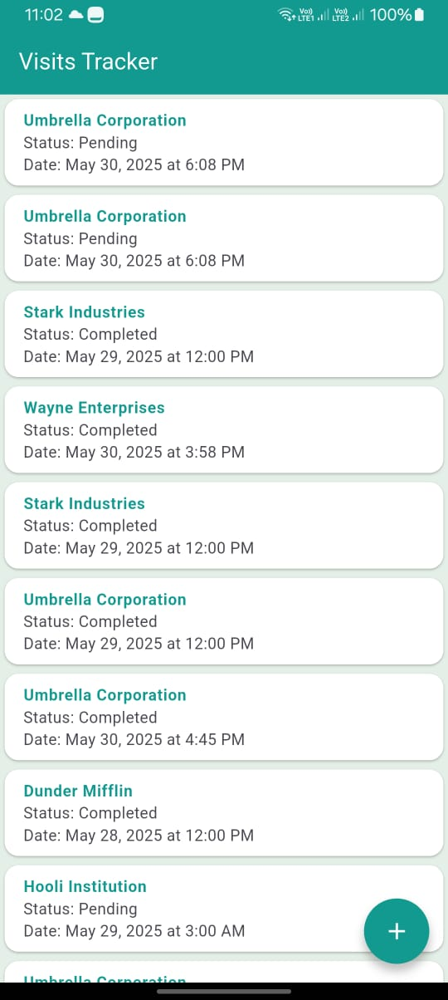
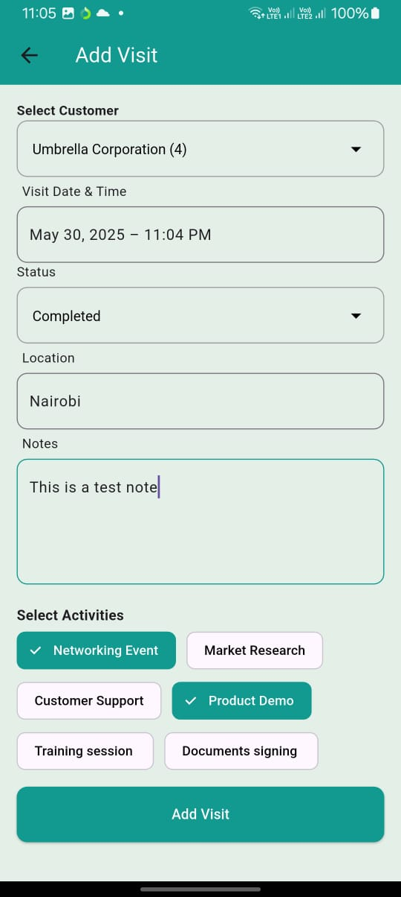
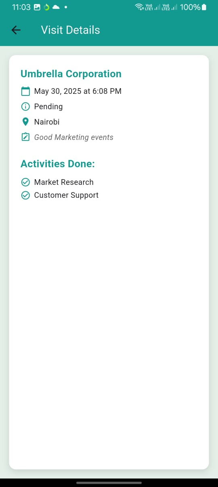

# 📱 Visit Tracker Flutter App

A Flutter-based Visit Tracker app for managing visits, customers, and activities. The app is
structured for maintainability, with a clear separation of concerns using controller-service-model
architecture. It includes custom UI widgets, state management, and optional offline support.

---

## 📸 Screenshots

> Add images in a `/screenshots` folder and reference them here.

- 
- 
- 

---

## 🧱 Project Structure

```plaintext
lib/
├── main.dart
├── app/
│   ├── bindings/              # Dependency injection setup
│   │   └── app_bindings.dart
│   ├── controllers/           # State management controllers
│   │   ├── visit_controller.dart
│   │   ├── customer_controller.dart
│   │   └── activity_controller.dart
│   ├── data/
│   │   ├── models/            # Data models
│   │   │   ├── visit_model.dart
│   │   │   ├── customer_model.dart
│   │   │   └── activity_model.dart
│   │   └── services/          # API/Firebase services
│   │       ├── api_service.dart
│   │       └── api_constants.dart
│   ├── pages/                 # UI screens
│   │   ├── home_page.dart
│   │   ├── add_visit_page.dart
│   │   ├── visit_detail_page.dart
│   │   └── stats_page.dart
│   └── routes/                # App navigation
│       ├── app_pages.dart
│       └── app_routes.dart
└── widgets/                   # Custom reusable widgets
    ├── visit_card.dart
    ├── custom_text_field.dart
    └── loading_widget.dart
```

---

## 🧠 Architectural Decisions

- **MVC-ish Separation**:  
  Controllers manage state, models represent structured data, services handle API/Firebase logic.

- **Modular Structure**:  
  Code is organized by responsibility: UI, data, logic, and routing are in distinct folders.

- **Dependency Injection**:  
  `bindings/` handles controller injection to reduce tight coupling.

---

## 📌 Assumptions, Trade-offs & Limitations

- **Assumes a stable internet connection unless offline support is implemented.**:

- **Form validation is basic and can be improved with more robust rules.**:

- **No login/auth screen included unless manually integrated.**:

---

## 🚀 Getting Started

### 1. Clone the project

```bash
git clone https://github.com/gmulonga/visit-tracker.git
cd visit-tracker
```

### Install flutter packages

```bash
flutter pub get
```

### Run the app

```bash
flutter run
```
